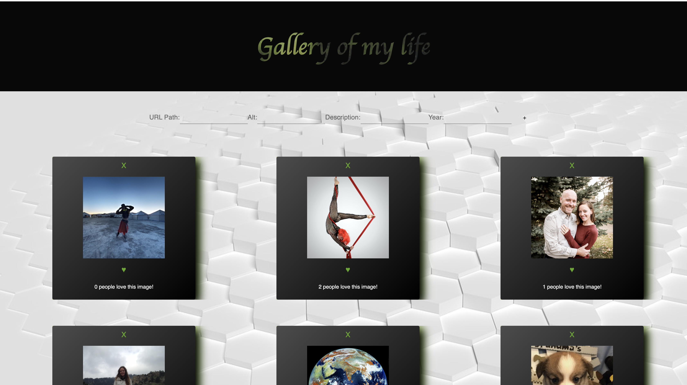

# PROJECT NAME

REACT PHOTO GALLERY

## Description

_Duration: 12 Hours_

This is a photo gallery of my life. It displays images from past to present. When an image is clicked, it flips over and the description of the life event is shared. A user may click the heart button to like the life event and the 'x' will remove the event from the gallery. New images and descriptions can be added to the gallery through the input boxes below the header and this will be stored in a database. 

To see the fully functional site, please visit: [DEPLOYED VERSION OF APP](https://ancient-castle-60137.herokuapp.com/)

## Screen Shot

### Prerequisites - dependencies

Link to software that is required to install the app (e.g. node).

- [Node.js](https://nodejs.org/en/)
- [express.js](https://expressjs.com/)
- [postgreSQL](https://www.postgresql.org/download/)
- [react](https://reactjs.org/docs/getting-started.html)
- [axios](https://www.npmjs.com/package/axios)
- [materialUI](https://material-ui.com/getting-started/installation/)
- [nodemon](https://www.npmjs.com/package/nodemon)

### SQL Requirements
- PostgreSQL

1. Create a postgres SQL database named `react_gallery` using an app like Postico.
2. The queries in the `databse.sql` file are set up to create all the necessary tables and populate the needed data to allow the application to run correctly. 
3. Open up your editor of choice and run an `npm install` - this will install the dependencies - `express.js`, `node.js`, `react`, `axios`, `materialUI`, `nodemon`, and `pg`.
4. Run the server first `npm run server`.
5. Run the client second (in a separate terminal) `npm run client`.
6. The `npm run client` command will open up a new browser tab for you!

## Usage

1. To add an image, put the url path in the inputbox associated with this, add an alternative text for the image, a description, and the year of the event in the associated input boxes, push the `+` button and this will add the image to the gallery, as well as the database.
2. To like an image, click the heart below the picture.
3. To remove and image, click the `X` above the image.
4. To view the description and year of the event, click on the image and the description and date will replace the image. You can toggle back and forth between the image description.

## Built With

List technologies and frameworks here
- HTML
- CSS
- javaScript
- react
- node
- express
- postgreSQL
- material UI

## License

## Acknowledgement

Thank you to Josie, for being my coding buddy. Thank you to Steven and Jordan for supporting me and answering all my questions. Thanks to [Prime Digital Academy](www.primeacademy.io) who equipped and helped me to make this application a reality. Special thanks to my primary instructor, 
-[Mary Mossman](https://github.com/mbMosman)
-[Josie Fredericksen](https://github.com/freder48)
-[Jordan Newberry](https://github.com/jordanNewberry21)
-[Steven Maloney](https://github.com/sdeda1us)

## Support

If you have suggestions or issues, please reach out to me on linkedIn [https://www.linkedin.com/in/kimberly-orchard-she-her-49b0171b9/]
